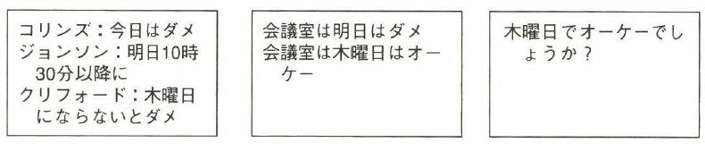
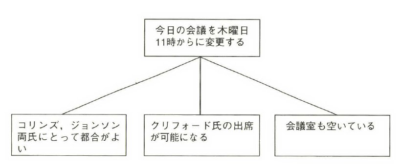

.. How To Reasonable Presentation documentation master file, created by
   sphinx-quickstart on Sun Jun 17 10:01:59 2012.
   You can adapt this file completely to your liking, but it should at least
   contain the root `toctree` directive.

How To Reasonable Presentation
==============================

発表するひと
------------

Noriyuki Hosaka

@bgnori

http://github.com/bgnori

なんで？
--------
アイディアは個人が生み出す

あなたももちろん生み出す

他の人に伝える →  世の中よくなる!!

ではどうすればよく伝わるのか？

よい知らせ・悪い知らせ
----------------------
悪い知らせ: 似たような失敗が頻出

よい知らせ: 改善は簡単

.. 料理にたとえれば愛があれば食べられるレベルに到達。(レストランではない)

守・破・離 → 守のレベル
 (武術の三段階)

内容の流れ
----------
プレゼンとは

プレゼンの善し悪し

構成の原理

プレゼンの構造

発表までにすること

プレゼンとは？(1)
------------------
コミュニケーションの形態

定義： 人と人の間での意思の疎通

意志

言語表現

言語の伝達(音、文字、etc.)

プレゼンとは？(2)
-----------------

定義：
 a. 「ある特定の分野の知識/アイディアの伝達」
 b. one to many の聴覚、視覚 
 c. リアルタイム、場所

内容の流れ
----------
プレゼンとは

**プレゼンの善し悪し**

構成の原理

具体的な方針

発表までにすること

プレゼンが「よい」とは？
------------------------
テーマ選びは範囲外

意志疎通を達成

最大限の効果(時間etcに対して)

条件(from 定義)を生かす技法
 b. one to many の聴覚、視覚 
 c. リアルタイム、場所

まずいプレゼン
--------------
「天国に至る道は、地獄に至る道を熟知することである」(ニコラ・マキアベェッリ）

怒りを買うプレゼン（間違っている内容）

眠いプレゼン(見せる技術に問題)

内容の正しさ
------------
今回の話の中心では **ない** 。

作った物を読み直す

出典

他人のレビュー

起承転結の罪 
------------
「転」は不要

小説等の「物語」→ 意外性

意外性 → わかりにくさ

意外性は過程には不要

文章を書く罪
------------

"slideument"

slide + document の造語

ドキュメントと兼用

字で埋め尽くされたslide

聞き手の注意がばらばらに

内容の流れ
----------
プレゼンとは

プレゼンの善し悪し

**構成の原理**

具体的な方針

発表までにすること

構成の原理
----------
「起承転結」ではなく・・・

* テーマの確認

* 前提知識

* 本体
  * ピラミッド法則
  * MECE
  * so what/so why

ピラミッドの法則(1)
-------------------
情報が入ってきた時系列

.. s6:: styles

    'div/img': {left:'0', height:'25%'}

ピラミッドの法則(2)
-------------------
結論をtopに、条件を要素に

.. s6:: styles

    'div/img': {left:'0', height:'25%'}

.. from 「考える技術・書く技術・問題解決力を伸ばすピラミッド原則」バーバラ・ミント ISBN 4478490279

MECE
----
Mutually Exclusive and Collectively Exhaustive

漏れなし、かぶりなし

* 列挙, 同一カテゴリ
* 漏れがあれば破綻
  * さしすせそ: 砂糖、塩、酢、醤油、味噌
* かぶりがあれば混乱
  * ペット: 犬・猫・ミニブタ・ダックスフント

so what/so why
--------------

* item間の関係

* 上下間の関係

* 掘り下げ, 展開

内容の流れ
----------
プレゼンとは

プレゼンの善し悪し

構成の原理

**具体的な手法**

発表までにすること

具体的な方針(1)
---------------
表紙/who

動機/「目次」

中身

まとめ

分量めやす: 1枚あたり1分

具体的な方針(2)
---------------
心得: "less is more"

文章では無くキーワード列挙

アニメーション禁止
 * 無いと説明ができないのか？

タイトルは必須
 * 個々のslideはピラミッド

具体的な方針(3)
---------------
同じタイトルなら番号を

一方通行、必要なら同じslideを

十分に大きな文字で

絵の枚数は1枚

具体的な方針(4)
----------------
関係ない物禁止

笑いをとるな、中身で勝負

内容の流れ
----------
プレゼンとは

プレゼンの善し悪し

構成の原理

具体的な方針

**発表までにすること**

発表までにすること
------------------

* 練習、練習、練習、練習

* 問うべきこと: 削れないか？

* 詰まる →  内容を見直せ

* 録音・録画

* どれだけやれば十分か？

練習の巾乗法則
--------------

2倍に上達 100回, 4倍に上達 10000回

.. image:: source/origami-practice.jpg 

.. s6:: styles

    'div/img': {textAlign: 'center', height:'60%'}

.. from 第50回 練習の効果 (増井俊之の「界面潮流」、ワイアードビジョン)
   http://archive.wiredvision.co.jp/blog/masui/201012/201012141330.html
   木村氏は、吉澤章氏の「創作折り紙」という本で紹介されている
   「みそさざい」という作品を15万回折り続け、折るのにかかった
   時間がどのように変化したかを記録しました。折るのに要した時
   間を縦軸に/試行回数を横軸にして両対数グラフを描いた結果と
   して以下の図が報告されています。

練習の例
--------
* 書写 『玄遠』

  * 読み＝ゲンエン

  * 大意＝おくぶかく遠し。言論などの淺薄ならざる義

* 当プレゼン

  * ２５枚以上になってから10hrとか

内容の流れ
----------
プレゼンとは

プレゼンの善し悪し

構成の原理

プレゼンの構造

発表までにすること

まとめ
------
アイディアを伝えよう

特性を生かす

適切な構造と構成

準備しよう

おまけ
------
「おれすげーいーことしゃべった」 

翌朝目覚めると何も変わってない （◞‸◟）

ありがとうございました
----------------------
`大祓（おおはらえ）`__

__ http://ja.wikipedia.org/wiki/%E5%A4%A7%E7%A5%93 

.. image:: source/chinowa.jpg

.. s6:: styles

    'div/img': {textAlign: 'center', height: '60%'}

